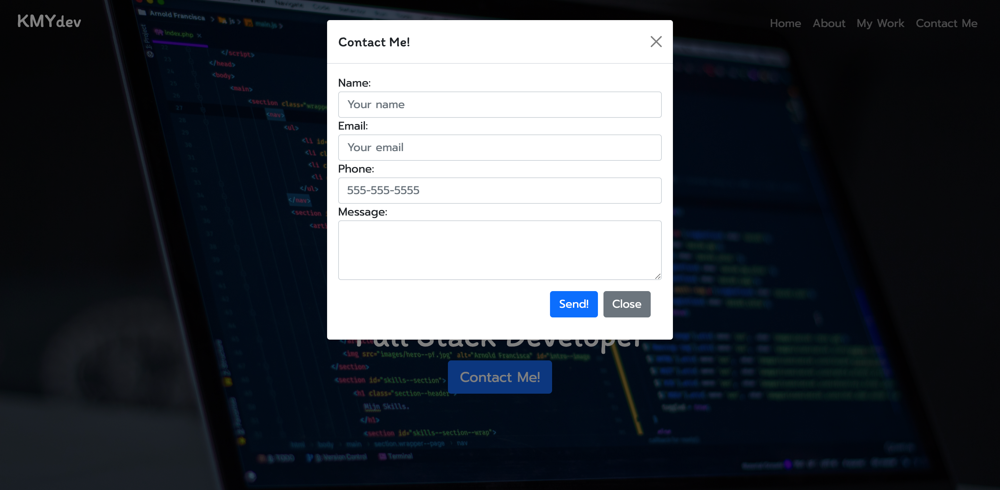
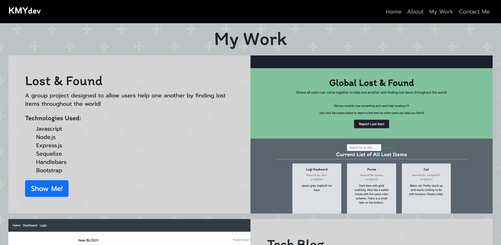
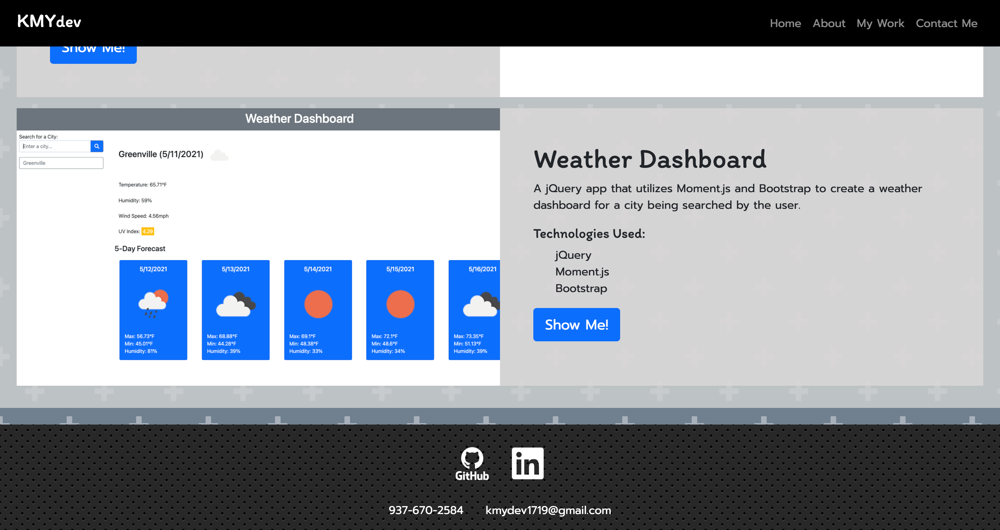

# KMYdev
Personal Portfolio Site

## Description

Personal portfolio site to display development skills and projects completed along the way.

## Technologies Used

* Javascript
* NodeJS
* npm
* Nodemailer
* dotenv
* express
* express-handlebars
* Heroku to deploy live app

## Table of Contents

- [KMYdev](#kmydev)
  - [Description](#description)
  - [Technologies Used](#technologies-used)
  - [Table of Contents](#table-of-contents)
  - [Screenshots](#screenshots)
    - [Home](#home)
    - [Contact Form](#contact-form)
    - [My Work](#my-work)
    - [Contact Me](#contact-me)
  - [Questions](#questions)

## Screenshots

### Home

### Contact Form

### My Work

### Contact Me

## Questions

Created by: [Youngin9210](https://github.com/Youngin9210)

For any further information or questions please contact me at [kyleyoung.9210@gmail.com](mailto:kyleyoung.9210@gmail.com)